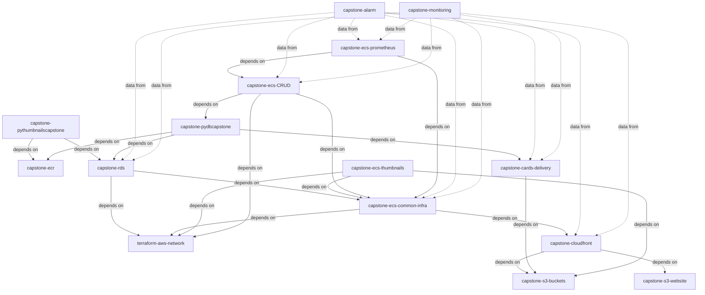

```mermaid
graph TB
    ecr[capstone-ecr];
    vpc-network[terraform-aws-network];
    pythumbnail[capstone-pythumbnailscapstone];
    cloudfront[capstone-cloudfront];
    rds[capstone-rds];
    carddelivery[capstone-cards-delivery];
    pydb[capstone-pydbcapstone];
    s3buckets[capstone-s3-buckets];
    s3website[capstone-s3-website];
    alarm[capstone-alarm];
    monitoring[capstone-monitoring];
    ecsthumbnails[capstone-ecs-thumbnails];
    ecsCRUD[capstone-ecs-CRUD];
    ecscommon[capstone-ecs-common-infra];
    ecsprometheus[capstone-ecs-prometheus];
    monitoring -.->|data from| ecsCRUD;
    monitoring -.->|data from| cloudfront;
    monitoring -.->|data from| rds;
    monitoring -.->|data from| ecsprometheus;
    monitoring -.->|data from| ecscommon;
    monitoring -.->|data from| carddelivery;
    alarm -.->|data from| ecsCRUD;
    alarm -.->|data from| cloudfront;
    alarm -.->|data from| rds;
    alarm -.->|data from| ecsprometheus;
    alarm -.->|data from| ecscommon;
    alarm -.->|data from| carddelivery;
    ecsprometheus -->|depends on| ecsCRUD;
    ecsprometheus -->|depends on| ecscommon;
    ecsCRUD -->|depends on| ecscommon;
    ecsCRUD -->|depends on| vpc-network;
    ecsCRUD -->|depends on| pydb;
    ecsthumbnails -->|depends on| s3buckets;
    ecsthumbnails -->|depends on| vpc-network;
    ecsthumbnails -->|depends on| ecscommon;
    ecscommon -->|depends on| vpc-network;
    ecscommon -->|depends on| cloudfront;
    pydb -->|depends on| ecr;
    pydb -->|depends on| rds;
    pydb -->|depends on| carddelivery;
    pythumbnail -->|depends on| ecr;
    pythumbnail -->|depends on| rds;
    carddelivery -->|depends on| s3buckets;
    rds -->|depends on| vpc-network;
    rds -->|depends on| ecscommon;
    cloudfront -->|depends on| s3buckets;
    cloudfront -->|depends on| s3website;
```