## Introduction
This project is part of the NTU Cloud Infrastructure Engineering (SCTP) Cohort 3 end-of-program capstone project. The theme of this project is Site Reliability Engineering (SRE). In this project, we showcase a monitoring solution on our GoodGreets website. Aside from the application, we showcase monitoring dashboards, metrics, alarms, and application logging that represent SRE.

## Team Members
- Low Chee Meng 
- Lim Tuang Yong Justin
- Tang Kwong Hoong
- Stephanie Wong

## Contents
- [Company Profile](#project-company-profile)
- [Website and Features](#website-and-features)
- [Solution Architecture](#solution-architecture)
- [Repository and Technology Stack](#repository-and-technology-stack)
- [Site Reliability Engineering Design Considerations](#site-reliability-engineering-design-considerations)
- [Project Management](#project-management)
- [Summary](#summary)
- [Future Improvements and Enhancements](#future-improvements-and-enhancements)
- [Appendix](#Appendix)

## Company Profile - The GoodGreets Company

Established in 2023, The GoodGreets Company was set up to bring joy to the hearts of family, friends, and colleagues with the simple act of sending a card. A user who wishes to send a card, can access the website and select a card design from a list of pre-loaded pictures. The user fills in the details of the recipient and schedules a date for the card to be sent. Thereafter, the user will be given a link to share for others to sign the card. The user could also upload a preferred picture of theirs to be used as the card design.

## Website and Features
| URL |
| ----------- |
| https://goodgreets.sctp-sandbox.com |

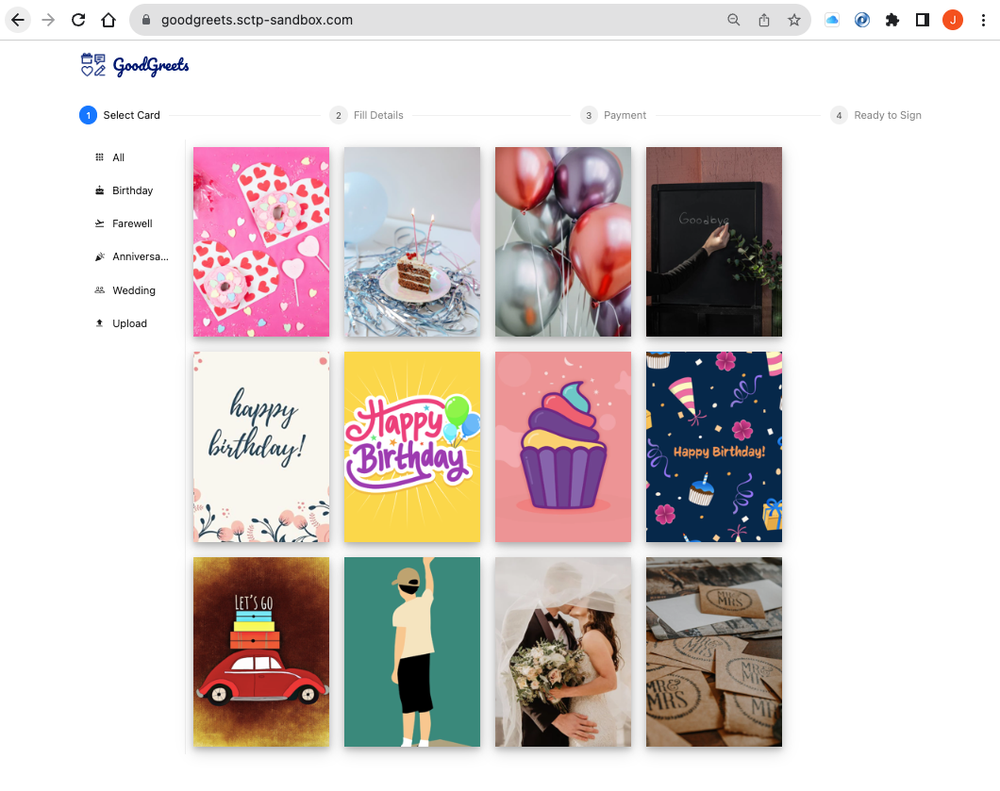

Image 1: Website Homepage

#### Feature 1: Card Image Upload
Users may wish to use their images as the card design. An image can be selected from the user's device and the user is required to complete a Captcha image before submitting the image.

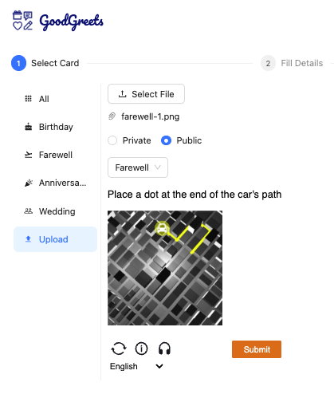

#### Feature 2: Scheduled Card Email
Once the card is scheduled, an automated cron job will be set up to send the card at a selected date and time automatically to the recipient's email.

## Solution Architecture
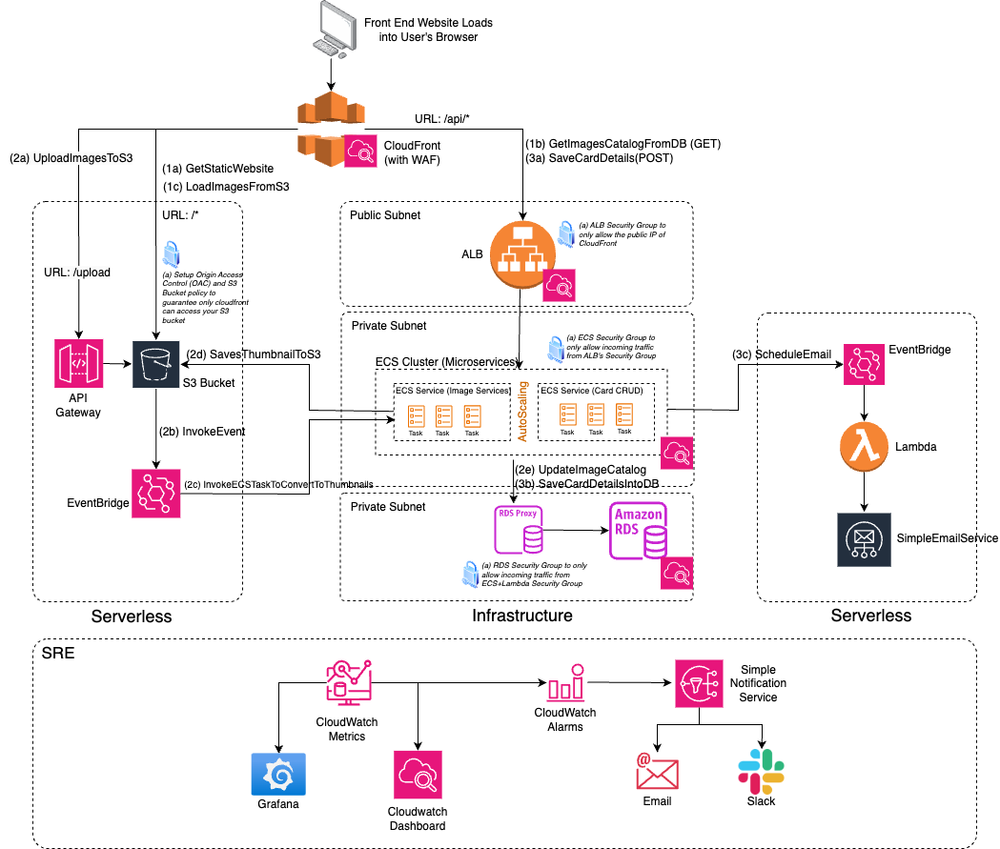

Image 2: Solution Architecture

- When a user accesses the website, the user is served with static website files stored in an AWS S3 bucket. S3 static website hosting is used as a web server. The website will make a JSON API call to get a list of card designs that contain the image source links. These image source links are stored in the AWS RDS database. The website will use these image source links to query the S3 bucket to get the images.

- The JSON API calls are fronted by an AWS Application Load Balancer (ALB) which contains a target group consisting of AWS ECS tasks. These ECS tasks hold the logic for the website's Card CRUD services (i.e. Create, Read, Update, and Delete cards). These ECS tasks sit within an ECS cluster that has AutoScaling enabled. The AutoScaling policy is set to scale the task count based on the CPU and Memory utilization of the cluster. The Card CRUD services interact with an AWS RDS MySql Database via an RDS Proxy to get data.

- On the website, the user could upload an image as the card design. When this function is called, a PUT request is issued into AWS API Gateway which proxies the S3 images bucket. AWS EventBridge is enabled on this S3 bucket to issue event notifications (i.e.S3 Object Created event). An ECS ephemeral task detects this event and resizes this image into a thumbnail. Thumbnails are used in the card catalog images, while actual images are used for the card sent to the recipient.

- Once a card is created, the ECS task will create a cron job using AWS EventBridge Scheduler. On the scheduled date and time, this schedular will call an AWS Lambda function, passing it the recipient name, email, and image path. This information will be used by the lambda function to query into the S3 images bucket to fetch the image and create an email. The email will be passed into AWS SNS and SES to be sent to the recipient.

- Cloudwatch metrics and logging are enabled on all the AWS resources where available. The metrics are exposed into dashboards for trend and real-time monitoring. The dashboarding tools used are AWS Cloudwatch Dashboard and AWS-managed Grafana. Dashboard views are split into sections to cater to the interests of different groups (e.g. Management, Developers, Security).

- For real-time alerts, Cloudwatch Alarms are also enabled on the entire infrastructure. Alerts are channelled into AWS SNS topics which send emails and Slack group alerts. 

## Repository and Technology Stack
To implement our architecture, we have logically grouped various infrastructure components into their code repository. This is to allow the decoupling of the infrastructure components to enable unimpeded development of each section of the infrastructure. Each group of infrastructure components could be deployed or teardown without impacting other parts of the infrastructure. (For example, The database resource contains data that should persist even though other application resources can be tear-down. Infrastructure that supports image upload is unrelated to the infrastructure related to card delivery, and both can be deployed/teardown separately.)

In total, there are 12 code repositories used to manage the application infrastructure and code.

**Github** is the version control system used for our code repository and **Terraform** is the Infrastructure as Code (IaC) tool used to deploy our AWS infrastructure components via **Github Actions**. The majority of the application's resources are set up via Terraform to create a controlled version of our infrastructure and to aid in re-deployment in another region in the event of disaster recovery.

| Repository | AWS Stack | Others |
| ---------- | --------- | --------- |
| https://github.com/friends-ce-3-group/capstone-cloudfront | CloudFront, WACL/WAF |
| https://github.com/friends-ce-3-group/capstone-s3-website | - | ReactJS |
| https://github.com/friends-ce-3-group/capstone-s3-buckets | S3, API Gateway, EventBridge | - |
| https://github.com/friends-ce-3-group/terraform-aws-network | VPC, NATGW, Subnets | - |
| https://github.com/friends-ce-3-group/capstone-ecs | ECS (Fargate), ALB, EventBridge, CloudFormation | Prometheus |
| https://github.com/friends-ce-3-group/capstone-ecr | ECR | - |
| https://github.com/friends-ce-3-group/capstone-pydbcapstone | - | Docker, boto3, Py-Flask |
| https://github.com/friends-ce-3-group/capstone-pythumbnailscapstone | - | Docker, boto3, Py-PIL, Py-MySQL |
| https://github.com/friends-ce-3-group/capstone-rds | RDS MySQL, RDS Proxy, KMS | - |
| https://github.com/friends-ce-3-group/capstone-cards-delivery | EventBridge, Lambda, SES | Python |
| https://github.com/friends-ce-3-group/capstone-monitoring | CloudWatch | Grafana | 
| https://github.com/friends-ce-3-group/capstone-alarm | CW Alarms, SNS | Slack |

#### Dependency Graph Between Repositories

The dependencies between the application and infrastructure components implemented in the separate repositories are as shown in the dependency graph below.

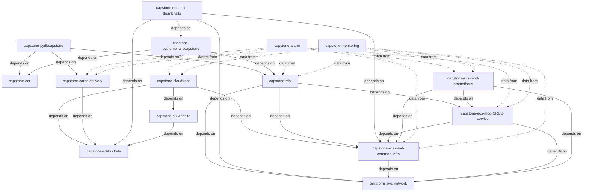

## Site Reliability Engineering Design Considerations
## SRE Aspect 1: Security
#### Security Groups and Origin Access Control

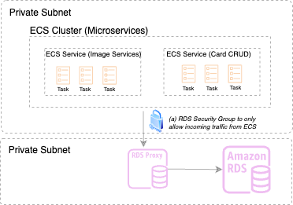

Security Groups are used throughout the infrastructure to protect resources from direct access. The RDS only allows inbound traffic from the security group of the ECS Tasks to ensure only ECS tasks can make connections to the database. The ECS service which contains the ECS tasks only allows inbound traffic coming from the Application Load Balancer (ALB). 

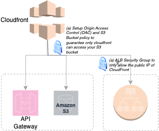

AWS Cloudfront distribution was set up with the ALB, S3 buckets, and API Gateway resources as the origin. The intention is to only allow access to these resources from Cloudfront. For example, S3 buckets should not be public and APIs should only called from Cloudfront hostnames. Cloudfront also serves as a Content Delivery Network to allow content to be cached at the edge so that end-users can experience faster access to our website content. 

#### AWS WAF, Shield, and Captcha
Web Application Firewall (WAF) and standard AWS Shield were set up to protect both the ALB and APIGateway resources. These tools allow us to track network traffic. In particular, the ability to have a geographical view of our visitors, bot detection, allowed/blocked requests and prevent DDoS attacks.

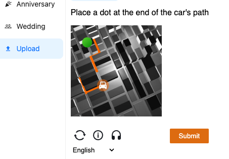

To prevent bot attacks on our upload images function, AWS Captcha was embedded into the upload button, requiring users to correctly solve the puzzle first before the upload is allowed.

#### RDS Proxy
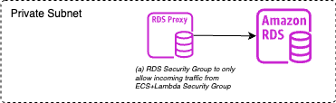

Assess into the RDS MySQL database is via the RDS Proxy, and only the security group of the ECS service is allowed inbound access into the RDS database. The benefit of using the RDS Proxy is to make the database more scalable and resilient to database failures, reducing failover times (Refer to [AWS RDS Proxy](https://aws.amazon.com/rds/proxy/)). This helps in database availability.

## SRE Aspect 2: Availability

#### Disaster Recovery, RTO and RPO
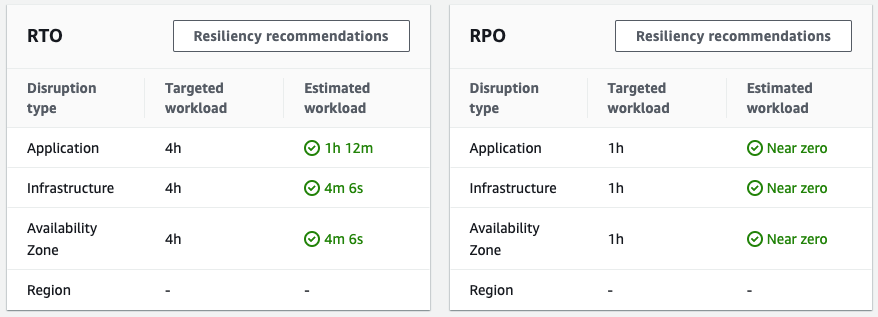

Based on AWS Resiliency Hub's assessment, our application and infrastructure should be able to withstand disaster recovery. Both recovery time objective (RTO) and recovery point objective (RPO) are within the threshold timings. **It is worth noting that the majority of AWS resources (including serverless infrastructure) are set up via Terraform**. So bringing back up the infrastructure in another AWS Region is straightforward.

#### Multiple Availabiliy Zones & AutoScaling for ECS Cluster

| Availability Zones | Auto Scaling Policy | MinTasks | DesiredTasks | MaxTasks | 
| ---------- | --------- | --------- | --------- | --------- |
| us-west-2a   us-west-2b | Target Tracking   CPUUtilization @ 80%   MemoryUtilization @ 60% | 2 | 4 | 8 | 

Availability Zones (AZ) are physically separate data centers within a region. The ECS cluster is deployed across two AZs to achieve a fault-tolerant architecture because if one AZ experiences issues, such as hardware failures or network problems, the other AZ can continue running the ECS cluster without disruption. If one AZ becomes unhealthy or experiences high traffic, ECS will automatically redirect traffic to healthy instances in other AZs. 

Application auto-scaling is also enabled and both CPU and memory utilisation is tracked to spin up additional compute resources when the workload is high, thereby enhancing application responsiveness and availability.

#### RDS & Replication

| Availability Zones | Type | Encryption | RDS Proxy | Replication | Storage AutoScaling |
| ---------- | ---------- | ---------- | ---------- | --------- | --------- | 
| us-west-2a (Primary)   us-west-2b (Secondary) | MySQL | AWS KMS | Yes | Yes | Disabled   *To be reviewed in future* |

A read replica is instantiated to augment the primary RDS instance. This helps to distribute the load and prevents read-intensive queries from impacting the performance of the primary instance. The read replica also provides redundancy for read operations; if the primary instance becomes unavailable, applications can still read from the read replica. It can also serve as a recovery data source when the data in the primary RDS instance is lost. 

## SRE Aspect 3: Monitoring Dashboard (Cloudwatch & Grafana)

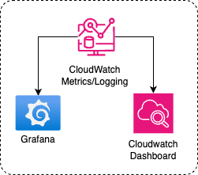

Monitoring includes metrics, text logging, structured event logging, distributed tracing, and event introspection. The application uses 4 AWS Cloudwatch services, mainly CloudWatch Metrics, Cloudwatch Logs, CloudWatch Alarms, and CloudWatch Dashboard to conduct realtime monitoring. In addition to Cloudwatch Dashboard, our team has also experimented with Grafana Dashboards to compare and contrast both tools.

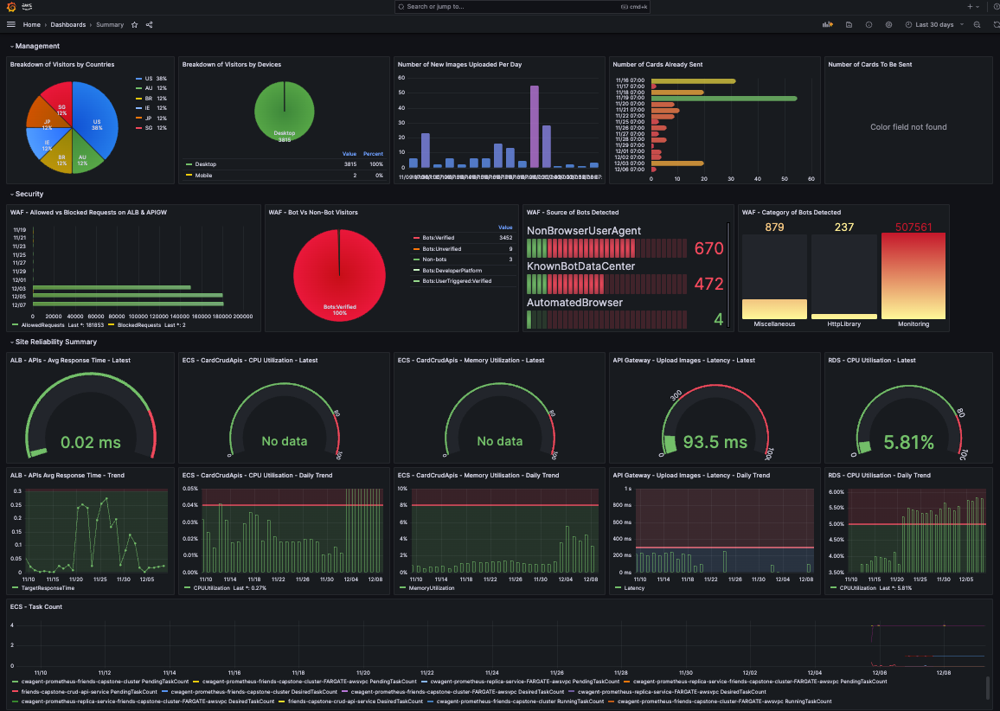

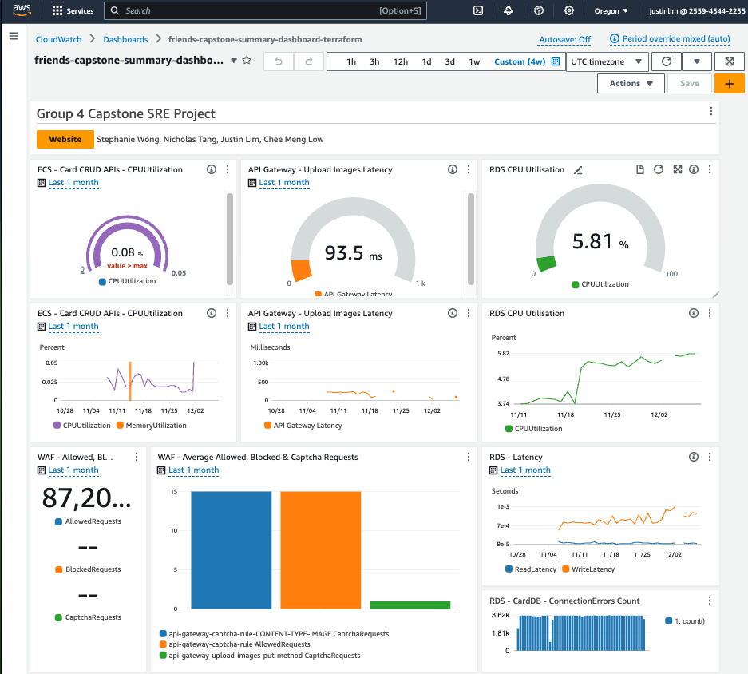

## SRE Aspect 4: Alarms (Emails & Slack)
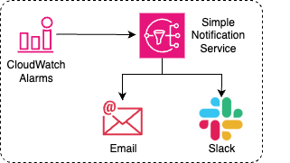

[TODO]

## SRE Aspect 5: Logging
[TODO]
## SRE Aspect 6: Improving Resiliency (AWS Resiliency Hub)
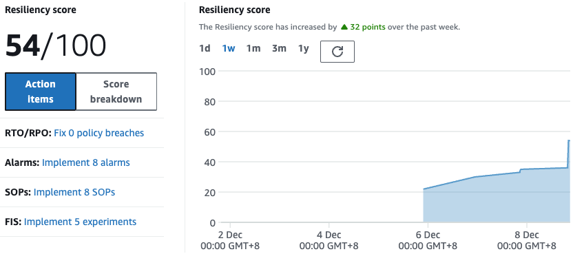

After the application and infrastructure code were set up, we relied on AWS Resiliency Hub service to conduct assessments on the website's resiliency. We found the assessments useful as they provided us with recommendations such as introducing more alarm types, s3 object versioning, and changes to both Lambda and ECS services configuration. We acted on some of these recommendations and managed to improve our resiliency score from 22/100 to 54/100. **Further changes to the application based on the assessment should be done to increase the resiliency score**.

## Project Management

The team used GitHub Projects as the project planning and management tool. The link to the project boards is [here](https://github.com/orgs/friends-ce-3-group/projects/3).

The project timeline was split into three sprints. The focus of the first sprint was on delivering the application and infrastructure components and on exploring options for monitoring and resilience assessment tools. In the second sprint, we made improvements to the security and availability settings of the infrastructure and began the implementation of monitoring tools. In the third and final sprint, we implemented the resilience assessment tool and finalised the monitoring system. 

## Summary

A three-tier web application for a greeting card website was designed, developed, and deployed in this project. The team implemented the application code for the website presentation and the database and data storage interface application layers, the IaC code for the AWS infrastructure components needed to support the application, the monitoring and alarms components required for observing the health of the entire system while in operation, and the code scanning tools that help us to measure and improve system availability and resilience.

The microservice architecture facilitated loose coupling between the infrastructure components. On this foundation, the team was able to concurrently implement multiple application and infrastructure components in separate repositories while minimising the problem of merge conflicts.

A project management tool was used for planning and issue tracking for our development and administrative tasks.

## Future Improvements and Enhancements

The improvements that we would like to make to the current implementation of the application are:

- Implement the modifications to the infrastructure as recommended by AWS Resiliency Hub.
- Address the vulnerabilities found in the container images by the ECR scanning service.
- Switch from RDS to DynamoDB for database services.
- Switch from ECS Task to AWS Lambda for the thumbnail conversion service.
- Implement application unit testing, security scanning, and static code analysis in CI workflows.
- Implement a multi-environment CD workflow with proper controls.

## Appendix
[TODO]
#### Links for Presentation
[TODO]