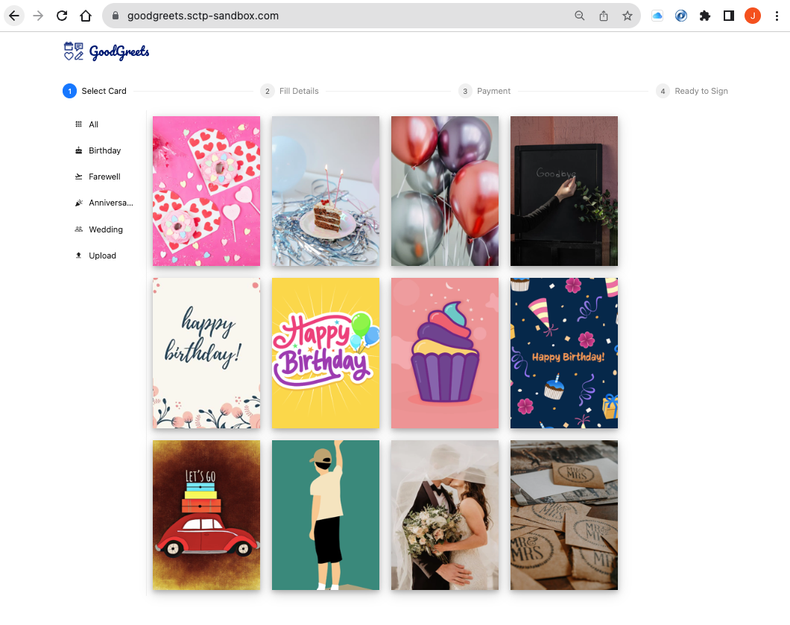
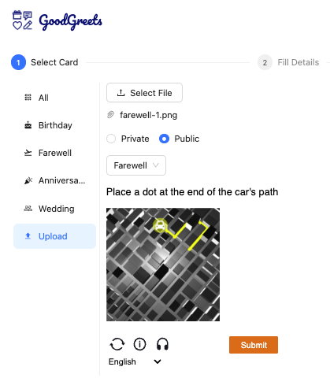
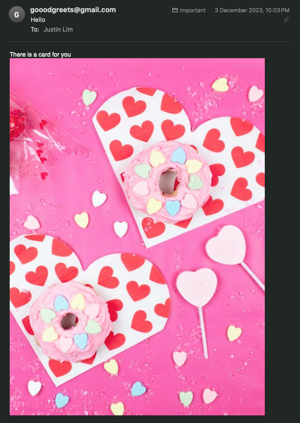
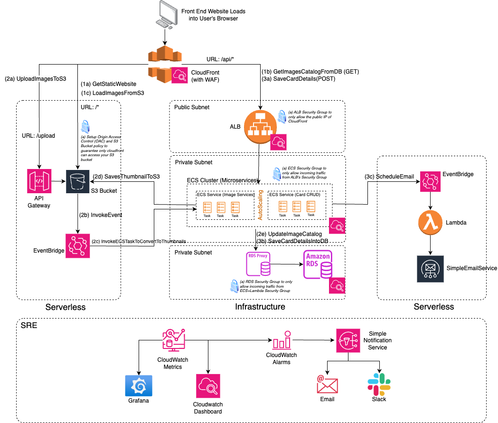

# The GoodGreets Company

## Company Profile
Established in 2023, The GoodGreets Company was set up to bring joy to the hearts of family, friends and colleagues with the simple act of sending a card. A user who wishes to send a card, can access the website and select a card design from a list of pre-loaded pictures. The user fills in the details of the recipient and schedule a date for the card to be sent. Thereafter, the user will be given a link to share for others to sign the card. The user could also upload a preferred picture of theirs to be used as the card design.

## Team Members
- Low Chee Meng 
- Lim Tuang Yong Justin
- Tang Kwong Hoong
- Stephanie Wong

## Topic
These project is part of NTU Cloud Infrastructure Engineering (SCTP) Cohort 3 end-of-program capstone project. The selected topic is on Site Reliability Engineering (SRE). In this project, we showcase a monitoring solution on our GoodGreets website. Aside from the application, we also showcase monitoring dashboards, metrices, alarms and application logging that represent SRE.

## Website and Core Features
| URL |
| ----------- |
| https://goodgreets.sctp-sandbox.com |

Image 1: Website Homepage

#### Feature 1: Card Image Upload
Users may wish to use their own images as the card design. An image can be selected from the user's own device and the user is required to complete a Captcha image before submitting the image.

#### Feature 2: Scheduled Card Email
Once the card is scheduled, an automated cron job will be set up to send the card at a selected date and time automatically to the recipient's email.

## Solution Architecture

Image 2: Solution Architecture

## Repository and Technology Stack
To implement our architecture, we have logically grouped various infrastructure components into its own code repository. This is to allow decoupling of the infrastructure components to enable efficient development of each component by various developers. In addition, each group of infrastructure components could be deployed or teardowned without impacting other parts of the infrastructure.

**Github** is the version control system used for our code repository and **Terraform** is the Infrastructure as Code (IaC) tool used to deploy our AWS infrastructure components via **Github Actions**.

In total, there are 12 code repositories used to manage the application infrastructure and code.

| Repository | AWS Stack | Others |
| ---------- | --------- | --------- |
| https://github.com/friends-ce-3-group/capstone-cloudfront | CloudFront, WACL/WAF |
| https://github.com/friends-ce-3-group/capstone-s3-website | - | ReactJS |
| https://github.com/friends-ce-3-group/capstone-s3-buckets | S3, API Gateway, EventBridge | - |
| https://github.com/friends-ce-3-group/terraform-aws-network | VPC, NetGW, Subnets | - |
| https://github.com/friends-ce-3-group/capstone-ecs | ECS (Fargate), ALB, EventBridge | Prometheus |
| https://github.com/friends-ce-3-group/capstone-ecr | ECR | - |
| https://github.com/friends-ce-3-group/capstone-pydbcapstone | - | Python |
| https://github.com/friends-ce-3-group/capstone-pythumbnailscapstone | - | Python |
| https://github.com/friends-ce-3-group/capstone-rds | RDS MySQL, KMS | - |
| https://github.com/friends-ce-3-group/capstone-cards-delivery | EventBridge, Lambda, SNS, SES | Python |
| https://github.com/friends-ce-3-group/capstone-monitoring | CloudWatch | Grafana | 
| https://github.com/friends-ce-3-group/capstone-alarm | CW Alarms, SNS | Slack |

## SRE Aspect 1: Security
#### Security Groups and Origin Access Control
[TODO]
#### AWS Captcha
[TODO]
#### RDS Proxy
[TODO]
## SRE Aspect 2: Availability
[TODO]
## SRE Aspect 3: Monitoring Dashboard (Cloudwatch & Grafana)
[TODO]
## SRE Aspect 4: Alarms (Emails & Slack)
[TODO]
## SRE Aspect 5: Logging
[TODO]
## SRE Aspect 6: Improving Resiliency (AWS Resiliency Hub)
[TODO]
## Improvements and Future Enhancements
[TODO]