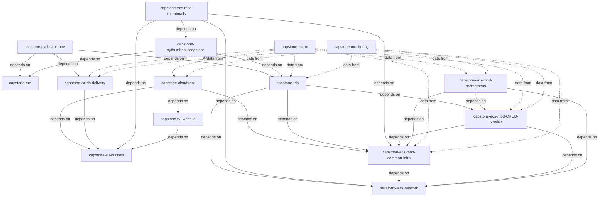
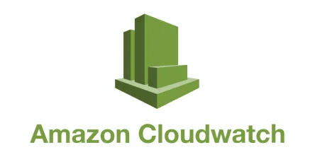
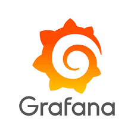
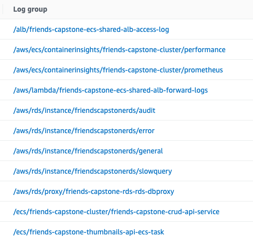

## Introduction
This document is a report for a capstone project done as part of the NTU Cloud Infrastructure Engineering (Cohort 3) SCTP program. The theme of the project is Site Reliability Engineering (SRE). The development team implemented a 3-tier web application and its infrastructure along with monitoring dashboards, metrics, alarms, and application logging that are central to SRE activities.

## Project Team
- Lim Tuang Yong Justin
- Low Chee Meng 
- Tang Kwong Hoong
- Stephanie Wong

## Contents
- [Company Profile](#project-company-profile)
- [Website and Features](#website-and-features)
- [Solution Architecture](#solution-architecture)
- [Repository and Technology Stack](#repository-and-technology-stack)
- [Site Reliability Engineering Design Considerations](#site-reliability-engineering-design-considerations)
- [Project Management](#project-management)
- [Summary](#summary)
- [Future Work](#future-work)
- [Appendix](#Appendix)

## Company Profile - The GoodGreets Company

Established in 2023, The GoodGreets Company was set up to bring joy to the hearts of family, friends, and colleagues with the simple act of sending a card. A user who wishes to send a card, can access the website and select a card design from a list of pre-loaded pictures. The user fills in the details of the recipient and schedules a date for the card to be sent. Thereafter, the user is given a link to share with others to sign the card. The user can also upload a preferred picture of theirs to be used as the card design.

## Website and Features
| URL |
| ----------- |
| https://goodgreets.sctp-sandbox.com |

Image 1: Website Homepage

#### Feature 1: Card Image Upload
Users may prefer to use their own images over the stock images provided by the website. In this case, an image can be selected from the user's device and the user is required to complete a Captcha image before submitting the image.

#### Feature 2: Scheduled Card Email
Once the card is scheduled, an automated cron job will be set up to send the card at a selected date and time automatically to the recipient's email.

## Solution Architecture

Image 2: Solution Architecture

When a user accesses the website, the user is served with static website files stored in an AWS S3 bucket. S3 static website hosting is used as a web server. The website will make a JSON API call to get a list of card designs that contain the image source links. These image source links are stored in the AWS RDS database and the website will use them to query the S3 bucket to retrieve the images.

The JSON API calls are fronted by an AWS Application Load Balancer (ALB) that forwards the traffic to a target group consisting of AWS ECS tasks. These ECS tasks provide RDS database access services (i.e. Create, Read, Update, and Delete cards) to the website and are created within an ECS cluster that has auto-scaling enabled. The auto-scaling policy scales the task count based on the CPU and Memory utilization of the cluster. The Card CRUD services provided by the JSON API interact with an AWS RDS MySQL Database via a RDS Proxy to get data.

On the website, the user may upload an image as the card design. When this function is called, a PUT request is issued to AWS API Gateway which proxies the S3 images bucket. AWS EventBridge is enabled on this S3 bucket to issue event notifications with a S3 Object Created event. An ECS ephemeral task detects this event and resizes this image into a thumbnail. The thumbnails of the cards are displayed on the website as the sample images, while the cards that are emailed to the target recipients are full sized images.

Once a card is created, the ECS task will create a cron job using the AWS EventBridge Scheduler. On the scheduled date and time, this scheduler will call an AWS Lambda function together with the recipient name, email, and image path in the JSON request. The AWS Lambda function then uses the AWS SDK for Python (Boto3) to retrieve the target card image in the S3 images bucket and create an email to be sent to the recipient using AWS Simple Email Service (SES).

Cloudwatch metrics and logging are enabled on all the AWS resources where available. The metrics storing current and historical data are exposed for real-time tracking on monitoring dashboards. The dashboarding tools used are AWS Cloudwatch Dashboards and AWS Managed Grafana (AMG). Dashboard views are split into tabs, namely, the Management, Developers, and Security sections, to address the requirements of different stackholders.

For real-time alerts, Cloudwatch Alarms are also enabled on the entire infrastructure. Alerts are channelled into AWS SNS topics which then trigger email and Slack group alerts. 

## Repository and Technology Stack
To implement our architecture, we have grouped the code for the various application and infrastructure components into twelve separate GitHub repositories. This reinforced the decoupling of the infrastructure components and facilitated unimpeded development of each section of the infrastructure. Each group of infrastructure components can be deployed or torn down without impacting other parts of the infrastructure. For example, the database resource contains data that should persist even though other application resources can be torn down, and the infrastructure components that support image upload are unrelated to the components responsible for card delivery hence both can be deployed and torn down separately.

We use Terraform as the primary Infrastructure as Code (IaC) tool, Github for code storage and version control, and GitHub Actions for continuous integration and deployment. The majority of the application's resources are set up via Terraform to create a controlled version of our infrastructure and to aid in re-deployment in another region in the event of disaster recovery.

| Repository | AWS Stack | Others |
| ---------- | --------- | --------- |
| https://github.com/friends-ce-3-group/capstone-cloudfront | CloudFront, WACL/WAF |
| https://github.com/friends-ce-3-group/capstone-s3-website | - | ReactJS |
| https://github.com/friends-ce-3-group/capstone-s3-buckets | S3, API Gateway, EventBridge | - |
| https://github.com/friends-ce-3-group/terraform-aws-network | VPC, NATGW, Subnets | - |
| https://github.com/friends-ce-3-group/capstone-ecs | ECS (Fargate), ALB, EventBridge, CloudFormation | Prometheus |
| https://github.com/friends-ce-3-group/capstone-ecr | ECR | - |
| https://github.com/friends-ce-3-group/capstone-pydbcapstone | - | Docker, Python (boto3, MySQL, Flask) |
| https://github.com/friends-ce-3-group/capstone-pythumbnailscapstone | - | Docker, Python (boto3, MySQL, PIL) |
| https://github.com/friends-ce-3-group/capstone-rds | RDS MySQL, RDS Proxy, KMS | - |
| https://github.com/friends-ce-3-group/capstone-cards-delivery | EventBridge, Lambda, SES | Python (boto3) |
| https://github.com/friends-ce-3-group/capstone-monitoring | CloudWatch | Grafana | 
| https://github.com/friends-ce-3-group/capstone-alarm | CW Alarms, SNS | Slack |

#### Dependency Graph Between Repositories

The dependencies between the application and infrastructure components implemented in the separate repositories are as shown in the dependency graph below, where the *depends on* and *data from* relationships represent resource deployment and data logging interdependencies respectively.

## Site Reliability Engineering Design Considerations
## SRE Aspect 1: Security
#### Security Groups and Origin Access Control

Security Groups are used throughout the infrastructure to protect resources from direct access. The RDS only allows inbound traffic from the security group of the ECS tasks to ensure that only ECS tasks can make connections to the database. The ECS service which contains the ECS tasks only allows inbound traffic from the ALB. 

AWS CloudFront distribution was set up with the ALB, S3 buckets, and API Gateway resources as the origin. The intention was to only allow access to these resources from AWS CloudFront. For example, S3 buckets should be private and APIs should only called from CloudFront hostnames. CloudFront also serves as a Content Delivery Network to allow content to be cached at the edge so that end-users can experience faster access to our website content. 

#### AWS WAF, Shield, and Captcha
AWS Web Application Firewall (WAF) and standard AWS Shield were set up to protect both the ALB and API Gateway resources. These tools allow us to track network traffic. Furthermore, it provides a range of features including bot detection, rule definitions to block or allow web requests, tracking the geographic locations of the website's visitors and also preventing DDoS attacks.

To prevent bot attacks on our upload images function, AWS Captcha was embedded into the upload button, requiring users to correctly solve the puzzle first before the upload is allowed.

#### RDS Proxy

Access into the RDS MySQL database is via the RDS Proxy, and only the security group of the ECS service is allowed inbound access into the RDS database. The benefit of using the RDS Proxy is to make the database more scalable and resilient to database failures, thereby reducing failover times (Refer to [AWS RDS Proxy](https://aws.amazon.com/rds/proxy/)). This helps to improve database availability.

## SRE Aspect 2: Availability

#### Disaster Recovery, RTO and RPO

Based on AWS Resilience Hub's assessment, our application and infrastructure should be able to withstand disaster recovery. Both the recovery time objective (RTO) and recovery point objective (RPO) are within the threshold timings. **It is worth noting that the majority of AWS resources (including serverless infrastructure) are set up via Terraform**. So bringing back up the infrastructure in another AWS Region is straightforward.

#### Multiple Availabiliy Zones & Auto-Scaling for ECS Cluster

| Availability Zones | Auto-Scaling Policy | MinTasks | DesiredTasks | MaxTasks | 
| ---------- | --------- | --------- | --------- | --------- |
| us-west-2a   us-west-2b | Target Tracking   CPUUtilization @ 80%   MemoryUtilization @ 60% | 2 | 4 | 8 | 

Availability Zones (AZ) are physically separate data centers within a region. The ECS cluster is deployed across two AZs to achieve a fault-tolerant architecture; in the event that one AZ experiences problems such as hardware or network failures, the other AZ can continue running the ECS cluster without disruption. Furthermore, if one AZ becomes unhealthy or experiences high traffic, ECS will automatically redirect traffic to healthy instances in other AZs. 

Application auto-scaling was enabled and both CPU and memory utilization are tracked to provision additional compute resources when the workload is high, thereby enhancing application responsiveness and availability.

#### RDS & Replication

| Availability Zones | Type | Encryption | RDS Proxy | Replication | Storage Auto-Scaling |
| ---------- | ---------- | ---------- | ---------- | --------- | --------- | 
| us-west-2a (Primary)   us-west-2b (Secondary) | MySQL | AWS KMS | Yes | Yes | Disabled   *To be reviewed in future* |

A read replica is deployed to augment the primary RDS instance. Its purpose is to distribute the load and prevent read-intensive queries from degrading the performance of the primary instance. The read replica also provides redundancy for read operations; if the primary instance becomes unavailable, applications can still read from the read replica. It also serves as a recovery data source when the data in the primary RDS instance is lost. 

## SRE Aspect 3: Monitoring Dashboard (Cloudwatch & Grafana)

Monitoring includes metrics, text logging, structured event logging, distributed tracing and event introspection. The application uses four AWS CloudWatch services, mainly CloudWatch Metrics, Logs, Alarms, and Dashboards to conduct monitoring. We also set up Grafana dashboards to compare and contrast the graphical and configuration aspects of both tools.

| Type | Link |
| ---- | ---- |
| Cloudwatch Dashboard | [Link](https://us-west-2.console.aws.amazon.com/cloudwatch/home?region=us-west-2#dashboards/dashboard/friends-capstone-summary-dashboard-terraform) |
| Grafana Dashboard | [Link](https://g-655995145b.grafana-workspace.us-west-2.amazonaws.com/d/R9E5kkNIz/summary?orgId=1) | 

#### Images of Application's Monitoring Dashboards

#### Summary of Differences between Cloudwatch and Grafana Dashboards

|   |  |  |
| - | ------------------------------------- | ---------------------------------- |
| Multi-Cloud Integration | Only on AWS | Multi-platform |
| Installation            | Ready to use in AWS Management Console | Requires installation (if running Prometheus server on EC2) |
| Cost                    | Pay as you use | Free and paid tier |
| Data                    | Seamless integration with CloudWatch Logs | Data sources have to be manually connected |
| Alerts & Notification   | Alarms are easily created | Notification channels have to be added and configured |
| Metrics Management      | All metrics are read | Only filtered data is read and stored in a time-series database (TSDB) |
| Dashboard               | Ease of use | More complex to use, but has better User Interface (UI) and provides superior data visualisations compared to CloudWatch dashboards |

## SRE Aspect 4: Alarms (Emails & Slack)

The application relies on Cloudwatch metrics and logs for alerts. CloudWatch Alarms are set up to trigger emails and Slack message alerts in order to provide a real-time updates. Below is a summary of the alarms set up on various resources in the application architecture. More detailed information on the alarms is in this [link](Alarms.md).

| Resource | Count of Alarms | Summary of Alarm Type |
| ---------- | ---------- | ---------- | 
| AWS Lambda | 4 | Monitor Lambda function duration, invocation patterns, and memory usage for anomalies. Identify unusual invocation patterns, detect function throttling, and set up alerts for errors. Monitor memory utilization patterns and identify unusual trends in Lambda function memory usage | 
| Elastic Container Service | 1 | Monitor ECS CPU utilization | 
| S3 | 6 | Monitor latency of S3 requests | 
| Application Load Balancer | 6 | Monitor ALB logs for 4xx errors and set up alerts for 5xx errors. Detect elevated 5xx error counts and unhealthy hosts in the ALB. Identify instances of unhealthy hosts and monitor rejected connections. Set up alerts for elevated 5xx counts in ALB targets and detect elevated 4xx counts in ALB logs | 
| RDS | 6 | Monitor RDS CPU utilization | 
| WAF | 1 | Alert on elevated blocked requests in WAF | 
| NAT Gateway | 4 | Set up alerts for NAT Gateway port allocation errors, monitor the successful connection percentage, and detect any packet drops in the NAT Gateway | 

## SRE Aspect 5: Logging

The components of the application resources are configured to write logs into S3. These logs can be viewed in AWS region US-West-2's CloudWatch Logs as indicated in the image below. During testing, when the application did not behave as expected, the logs provided essential data that we used for debugging.

## SRE Aspect 6: Improving Resiliency (AWS Resilience Hub)

After the application and infrastructure code were set up, we made use of AWS Resilience Hub service to conduct assessments on the website's resilience. It provided us with a resilience score and recommendations on how to improve our infrastructure. We found the assessments useful as they provided us with recommendations such as introducing more alarm types, S3 object versioning, and changes to both Lambda and ECS services configuration. We acted on some of these recommendations and improved our resilience score from 22 to 54 out of a maximum score of 100. We intend to make further changes to the application based on the assessment results.

## Project Management

The team used GitHub Projects as the project planning and management tool. The link to the project boards is [here](https://github.com/orgs/friends-ce-3-group/projects/3).

The project timeline was split into three sprints. In the first sprint, the focus was on delivering the application and infrastructure components and on exploring options for monitoring and resilience assessment tools. In the second sprint, we made improvements to the security and availability settings of the infrastructure and began the implementation of monitoring tools. In the third and final sprint, we implemented the resilience assessment tool and finalised the monitoring system. 

## Summary

A 3-tier web application for a greeting card website was designed, developed, and deployed in this project. The team implemented the presentation and application layer code for the website and the backend business logic, the IaC code for the AWS infrastructure components needed to support the application, the monitoring and alarm components for observing the health of the system while in operation, and the code scanning tools that help us to measure and improve system availability and resilience.

The microservice architecture encouraged loose coupling between the infrastructure components. This allowed the team to concurrently implement multiple application and infrastructure components in separate repositories while minimising the problem of merge conflicts.

A project management tool was used for planning and issue tracking for our development and administrative tasks.

## Future Work

The improvements that we would like to make to the current implementation of the application are:

- Implement the modifications to the infrastructure recommended by AWS Resilience Hub.
- Address the vulnerabilities found in the container images by the ECR scanning service.
- Switch from RDS to DynamoDB for database services.
- Switch from ECS standalone task to AWS Lambda for the thumbnail conversion service.
- Make improvements on monitoring metrics and visualisation.
- Implement application unit testing, security scanning, and static code analysis in continuous integration (CI) workflows.
- Implement abstractions in the application code regarding usage of cloud provider specific libraries and resources.
- Implement a multi-environment continuous deployment (CD) workflow with proper controls.

## Appendix

#### Links for Presentation
| Page | Link |
| ---- | ---- |
| 1: Webpage | [Link](https://goodgreets.sctp-sandbox.com/) |
| 2: Solution Architecture | [Link](https://raw.githubusercontent.com/friends-ce-3-group/capstone-documentation/main/images/image-solution-architecture.png) |
| 3: CloudWatch Dashboard | [Link](https://us-west-2.console.aws.amazon.com/cloudwatch/home?region=us-west-2#dashboards/dashboard/friends-capstone-summary-dashboard-terraform) |
| 4: Grafana Dashboard | [Link](https://g-655995145b.grafana-workspace.us-west-2.amazonaws.com/d/R9E5kkNIz/summary?orgId=1) |
| 5: CloudWatch vs Grafana | [Link](ComparisonCWvsGrafana.md) |
| 6: CloudWatch Alarms | [Link](Alarms.md) |
| 7: Resilience Hub | [Link](https://us-west-2.console.aws.amazon.com/resiliencehub/home?region=us-west-2#/application/friends-capstone-resilience-hub/assessment-reports) |
